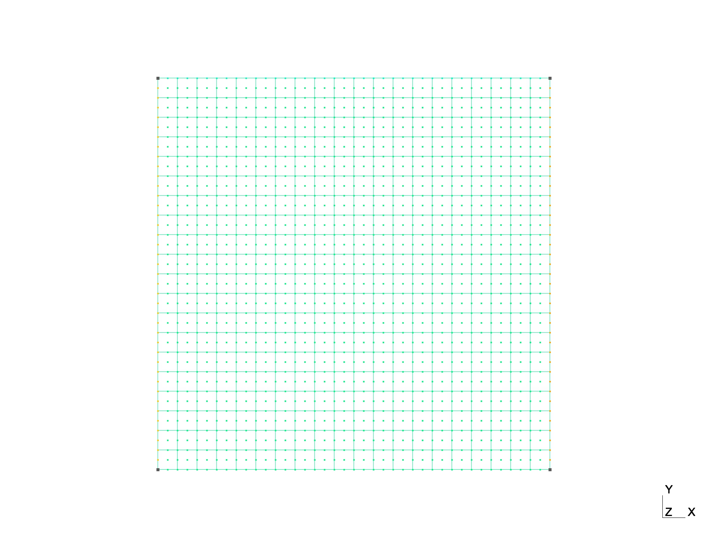
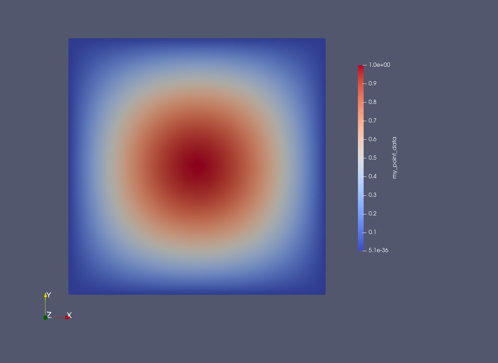

# Two dimensional examples

## A second order equation

Consider the following equation:
```math
	\left\{
	\begin{array}{l}
	-\Delta u  = f(x) \textrm{ in } x \in \Omega \\
	u(0) = 0 \textrm{ on } \Omega,
	\end{array}
	\right.
```
with \\( \Omega = (0, 1) \times (0, 1)\\).

```@example 2
using FEMTools
using SymPy
using LinearAlgebra
using SparseArrays
import gmsh
using WriteVTK
nothing #hide
```

### symbols 
```@example 2
x = SymPy.symbols("x")
h = SymPy.symbols("h")
nothing #hide
```

### discretization parameters

We use the mesh [square.msh](assets/square.msh) (in gmsh format).

This mesh is formed by quadratic quad elements.



`gmsh.jl module should be installed manually following the instructions on gmsh [web page](https://gmsh.info/#Download)
	
```@example 2
gmsh.initialize()
gmsh.open("square.msh")
nodes = gmsh.model.mesh.getNodes()
nodes_label = convert(Array{Int64}, nodes[1])
nodes_N = length(nodes_label)
nodes_coordinate = reshape(nodes[2], (3, nodes_N))
nodes_boundary = convert(Array{Int64}, unique(gmsh.model.mesh.getNodesByElementType(1)[1]))
nodes_boundary_N = length(nodes_boundary)

elements = gmsh.model.mesh.getElements()

elements_bound_label = convert(Array{Int64}, elements[2][1])
elements_bound_N = length(elements_bound_label)

elements_int_label = convert(Array{Int64}, elements[2][2])
elements_int_N = length(elements_int_label)

elements_bound = reshape(convert(Array{Int64}, elements[3][1]), (3, elements_bound_N))
elements_int = reshape(convert(Array{Int64}, elements[3][2]), (9, elements_int_N))
#gmsh.fltk.run()
gmsh.finalize()
nothing #hide
```

### elementary matrices - P2 x P2
```@example 2
elem_Mxy = FEMTools.get_square_lagrange_em((2, 2), (0, 0), (0, 0))
elem_Kxy = FEMTools.get_square_lagrange_em((2, 2), (1, 0), (1, 0)) +
    FEMTools.get_square_lagrange_em((2, 2), (0, 1), (0, 1))

dx = norm(nodes_coordinate[:, elements_bound[1,1]] - nodes_coordinate[:, elements_bound[2,1]])

elem_Kxy_dx = convert(Matrix{Float64}, elem_Kxy.subs(h, dx))
elem_Mxy_dx = convert(Matrix{Float64}, elem_Mxy.subs(h, dx));
nothing #hide
```

### global matrices
```@example 2
K = FEMTools.assemble_squaremesh_FE_matrix(elem_Kxy_dx, elements_int, order1=2, order2=2)
M = FEMTools.assemble_squaremesh_FE_matrix(elem_Mxy_dx, elements_int, order1=2, order2=2)
nothing #hide
```

### right hand side

We consider \\(f(x, y) = (2\pi^2 + 1) \sin(\pi x) \sin(\pi y)\\). 

This corresponds to the exact solution \\(u(x,y) = \sin(\pi x) \sin(\pi y)\\).

```@example 2
f = (2*pi^2 + 1) * sin.(pi * nodes_coordinate[1,:]) .* sin.(pi * nodes_coordinate[2,:])

F = M * f

A = K + M
nothing #hide
```

### boundary condition

```@example 2
tgv = 1e30
A[nodes_boundary, nodes_boundary] += tgv * sparse(Matrix{Float64}(I, nodes_boundary_N, nodes_boundary_N))
nothing #hide
```

### solve the linear system
```@example 2
u = A \ F
nothing #hide
```

### compute and display the error

```@example 2
u_exact = sin.(pi*nodes_coordinate[1,:]) .* sin.(pi*nodes_coordinate[2,:])
err = u - u_exact
println("L2 error : ", sqrt(err' * M * err))
println("H1 error : ", sqrt(err' * K * err))
```

### export to vtk

```@example 2
cells = [MeshCell(VTKCellTypes.VTK_QUADRATIC_QUAD, elements_int[1:8, i]) for i = 1:elements_int_N]
points_x = nodes_coordinate[1, :]
points_y = nodes_coordinate[2, :]
vtkfile = vtk_grid("ex3-output", points_x, points_y, cells)

vtkfile["my_point_data", VTKPointData()] = u
outfiles = vtk_save(vtkfile)
```

### affichage de la solution

L'affichage est obtenu à l'aide de Paraview à partir du fichier "ex3-output.vtu"



