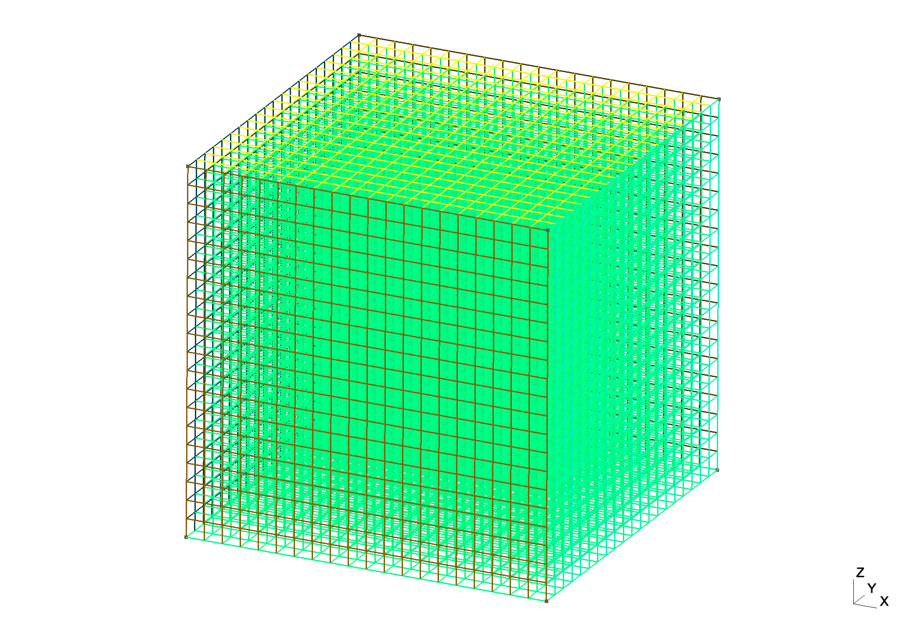

# Three dimensional examples

## A Poisson boundary value problem

Consider the following equation:
```math
	\left\{
	\begin{array}{l}
	-\Delta u + u  = f \textrm{ in }  \Omega \\
	u = 0 \textrm{ on } \Omega,
	\end{array}
	\right.
```

with \\( \Omega = (0, 1)^2\\).

```@example 1
using Revise
using SymFEL
using SymPy
using LinearAlgebra
using SparseArrays
import gmsh
using WriteVTK
```

### discretization parameters

We use the mesh [cube.msh](assets/cube.msh) (in gmsh format).
This mesh is formed by cubic elements.



`gmsh.jl` module should be installed manually following the instructions on gmsh [web page](https://gmsh.info/#Download)

```@example 1
gmsh.initialize()
gmsh.open("cube.msh")
nodes = gmsh.model.mesh.getNodes()
nodes_label = nodes[1]
nodes_N = length(nodes_label)
nodes_coordinate = reshape(nodes[2], (3, nodes_N))
nodes_boundary = unique(gmsh.model.mesh.getNodesByElementType(3)[1])
nodes_boundary_N = length(nodes_boundary)

elements = gmsh.model.mesh.getElements()

elements_bound_label = elements[2][1]
elements_bound_N = length(elements_bound_label)

elements_int_label = elements[2][2]
elements_int_N = length(elements_int_label)

elements_bound = reshape(elements[3][1], (4, elements_bound_N))
elements_int = reshape(elements[3][2], (8, elements_int_N))
gmsh.finalize()
nothing #hide
```

### elementary matrices - P1 x P1

```@example 1
elem_Mx = SymFEL.get_lagrange_em(1, 0, 0)
elem_Kx = SymFEL.get_lagrange_em(1, 1, 1)

nc = ([1, 2, 2, 1, 1, 2, 2, 1],
      [1, 1, 2, 2, 1, 1, 2, 2],
      [1, 1, 1, 1, 2, 2, 2, 2])
nr = nc

elem_Mxyz = SymFEL.get_cube_em(elem_Mx,
                               elem_Mx,
                               elem_Mx,
                               nc,
                               nr)

elem_Kxyz = SymFEL.get_cube_em(elem_Kx,
                               elem_Mx,
                               elem_Mx,
                               nc,
                               nr) +
            SymFEL.get_cube_em(elem_Mx,
                               elem_Kx,
                               elem_Mx,
                               nc,
                               nr) +
            SymFEL.get_cube_em(elem_Mx,
                               elem_Mx,
                               elem_Kx,
                               nc,
                               nr)


dx = norm(nodes_coordinate[:, elements_bound[1,1]] - nodes_coordinate[:, elements_bound[2,1]])

elem_Kxyz_dx = convert(Matrix{Float64}, elem_Kxyz.subs(h, dx))
elem_Mxyz_dx = convert(Matrix{Float64}, elem_Mxyz.subs(h, dx));
nothing #hide
```

### global matrices

```@example 1
K = SymFEL.assemble_cubemesh_FE_matrix(elem_Kxyz_dx, elements_int, order1=1, order2=1)
M = SymFEL.assemble_cubemesh_FE_matrix(elem_Mxyz_dx, elements_int, order1=1, order2=1)

f = (3*pi^2 + 1) * (sin.(pi * nodes_coordinate[1,:])
                    .* sin.(pi * nodes_coordinate[2,:])
                    .* sin.(pi * nodes_coordinate[3,:]))

F = M * f

A = K + M
nothing #hide
```

### boundary conditions

```@example 1
tgv = 1e30
A[nodes_boundary, nodes_boundary] += tgv * sparse(Matrix{Float64}(I, nodes_boundary_N, nodes_boundary_N))
nothing #hide
```

### solve linear systems and compute error

```@example 1
u = A \ F
u_exact = sin.(pi*nodes_coordinate[1,:]) .* sin.(pi*nodes_coordinate[2,:]) .* sin.(pi*nodes_coordinate[3,:])
err = u - u_exact

println("L2 error : ", sqrt(err' * M * err))
println("H1 error : ", sqrt(err' * K * err))
nothing #hide
```

### export to vtk

```@example 1
cells = [MeshCell(VTKCellTypes.VTK_HEXAHEDRON, elements_int[1:8, i]) for i = 1:elements_int_N]


points_x = nodes_coordinate[1, :]
points_y = nodes_coordinate[2, :]
points_z = nodes_coordinate[3, :]
vtkfile = vtk_grid("ex5-output", points_x, points_y, points_z, cells)

vtkfile["u", VTKPointData()] = u
outfiles = vtk_save(vtkfile)
nothing #hide
```


